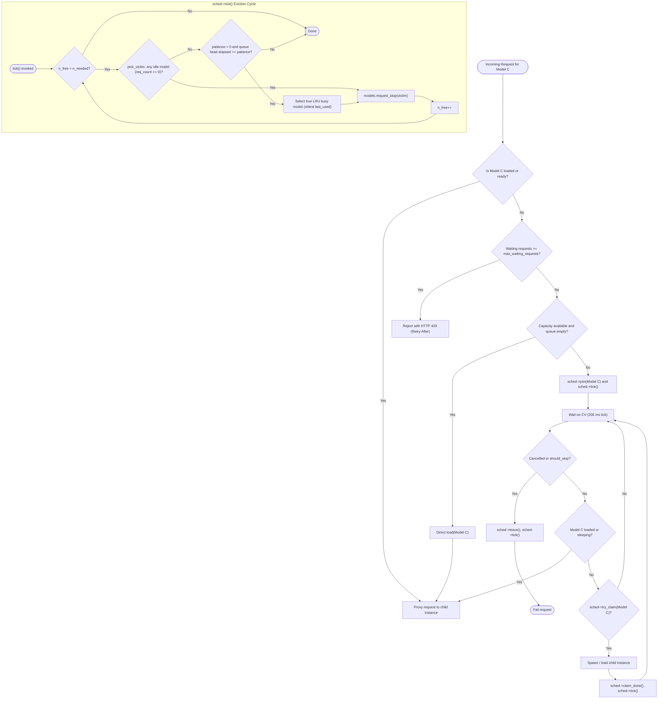
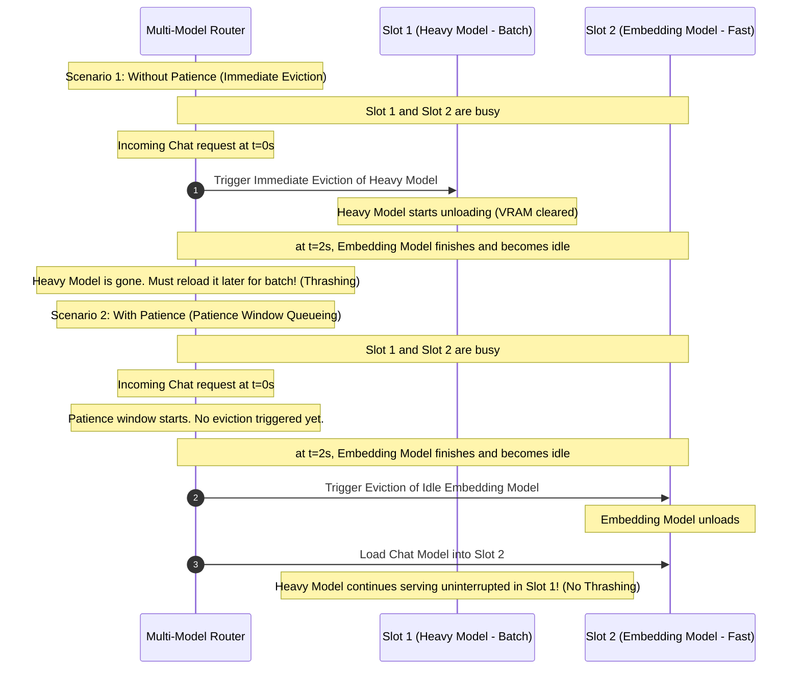
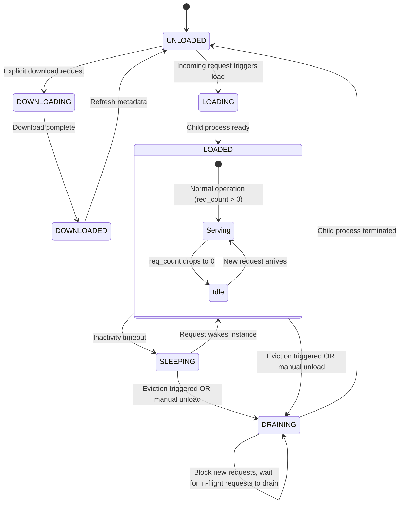

# Final Design: Request Queueing and Patience-for-Swap in Router Mode

This document describes the architecture, data flow, and design patterns implemented in `llama-server` Router mode to support request queueing, patience-for-swap time-slicing, and thread-pool exhaustion safeties (**[Issue #21678](https://github.com/ggml-org/llama.cpp/issues/21678)**), integrated with the multi-model LRU scheduler and conversation stream affinity.

---

## 1. Slot Allocation and Scheduling Flowchart

The model swap and slot scheduling process is orchestrated through `ensure_model_ready` and `server_lru_sched`. Requests targeting unloaded models are queued and coalesced. Eviction runs via non-blocking `sched->tick()` cycles that prioritize idle models before applying swap patience.

---

## 2. Patience Thrashing Mitigation Scenario

Below is a comparison sequence illustrating how the patience window avoids thrashing in a system with `models_max = 2` when serving a heavy batch model alongside lightweight ad-hoc chat and embedding requests.

---

## 3. Dynamic Model State Machine

---

## 4. Key Implementation Patterns

### A. Request Coalescing and LRU Scheduling (`server_lru_sched`)
To avoid duplicate model loads when concurrent requests arrive for the same unloaded model:
- `server_lru_sched` coalesces concurrent requests for model $M$ into a single queue entry (`entry_t`).
- The head waiter claims the slot via `sched->try_claim()` and spawns the child instance, while subsequent waiters share the entry and wake up once the instance reaches `LOADED`.
- Waiters safely leave the queue via `sched->leave()` on completion, error, or client cancellation.

### B. Non-Blocking Slot Eviction and Patience (`sched->tick`)
Slot eviction is managed reactively through `sched->tick()`:
- Computes available slots: `n_free = models_max - n_running + n_stopping - n_claimed`.
- While `n_free < n_needed`:
  1. **Idle Eviction**: Calls `pick_victim()` to find an idle model (`req_count == 0`) that is not stopping and not wanted by queued requests.
  2. **Patience-for-Swap**: If all models are busy and `--patience` is configured, checks whether the head of the queue has waited for at least `patience` seconds. If elapsed, selects the true LRU busy model (oldest `last_used`) for eviction.
  3. **Non-blocking Stop**: Calls `models.request_stop(victim)` which marks the model stopping and signals the child process to exit without blocking the scheduler or HTTP worker threads.

### C. Reactive State Updates
`sched->tick()` executes on key state transitions:
- When a new request queues (`sched->join()`).
- When an active request finishes proxying and its model becomes idle (`req_count == 0` in `proxy->cleanup`).
- When a model transitions state (such as `LOADING` to `READY`, or to `UNLOADED` in `update_status()`).
- When a load claim completes (`sched->claim_done()`) or a waiting request is cancelled.

### D. Thread-Pool Exhaustion Protections
Because `llama-server` uses synchronous `cpp-httplib` worker threads, blocking requests consume thread pool resources:
- Configured via `--max-waiting-requests`.
- If `n_waiting_requests >= max_waiting_requests`, incoming requests fail fast with `429 Too Many Requests` (OpenAI-compatible `rate_limit_error`) and a dynamic `Retry-After` header computed from remaining patience in `get_patience_retry_after()`.
- **Safety Cap**: If the user configures `max_waiting_requests >= thread_pool_size`, the server caps the limit to `max(1, thread_pool_size - 1)` and logs a warning. This guarantees at least 1 HTTP worker thread remains free for health checks and administrative endpoints.

### E. Graceful vs. Forced Manual Unloading
- **Graceful Unloading (Default)**: `POST /models/unload` transitions status to `DRAINING` and waits for in-flight requests (`req_count == 0`) before signalling child exit. New requests targeting the model are held via `wait_if_draining()`.
- **Forced Unloading**: `POST /models/unload` with `{"force": true}` bypasses request draining and immediately terminates the model subprocess.

### F. Direct Loading Synchronization (`reserve_slot`)
Direct administrative load requests (such as `POST /models/load`) bypass the HTTP request queue and invoke `reserve_slot()`. This provides a fallback synchronization point that enforces capacity constraints and patience before spawning the requested model.

### G. Resumable Stream Affinity (`conv_model_tracker`)
For HTTP routes supporting resumable streaming with `X-Conversation-Id`, `conv_model_tracker` records the serving model and assigns a unique ticket. Subsequent streaming requests resolve directly to the owning child instance without broadcast polling.

---

## 5. Files Changed

- **[arg.cpp](file:///home/ken/projects/llama.cpp/common/arg.cpp)**: Added CLI argument parser options for `--patience` and `--max-waiting-requests`.
- **[common.h](file:///home/ken/projects/llama.cpp/common/common.h)**: Updated `common_params` to include patience and queue configurations.
- **[server-common.h](file:///home/ken/projects/llama.cpp/tools/server/server-common.h)**: Declared HTTP 429 Too Many Requests response builder.
- **[server-common.cpp](file:///home/ken/projects/llama.cpp/tools/server/server-common.cpp)**: Implemented HTTP 429 response builder with dynamic `Retry-After` headers.
- **[server-models.h](file:///home/ken/projects/llama.cpp/tools/server/server-models.h)**: Declared `server_lru_sched`, `request_stop()`, `reserve_slot()`, `wait_if_draining()`, `get_patience_retry_after()`, and `SERVER_MODEL_STATUS_DRAINING`.
- **[server-models.cpp](file:///home/ken/projects/llama.cpp/tools/server/server-models.cpp)**: Integrated `server_lru_sched` with patience eviction, asynchronous `request_stop()`, bounded queueing, and graceful draining.
- **[server-routes.cpp](file:///home/ken/projects/llama.cpp/tools/server/server-routes.cpp)**: Handled `server_too_many_requests_error` and forwarded 429 responses with `Retry-After`.
- **[README.md](file:///home/ken/projects/llama.cpp/tools/server/README.md)**: Documented CLI options, queueing behavior, and model unloading.
- **[README-dev.md](file:///home/ken/projects/llama.cpp/tools/server/README-dev.md)**: Documented router mode model scheduling and eviction architecture.
- **[test_router.py](file:///home/ken/projects/llama.cpp/tools/server/tests/unit/test_router.py)**: Added unit test coverage for patience window, bounded queue rejection with `Retry-After`, and graceful draining.
- **[utils.py](file:///home/ken/projects/llama.cpp/tools/server/tests/utils.py)**: Added server test utility helpers and timeouts.
